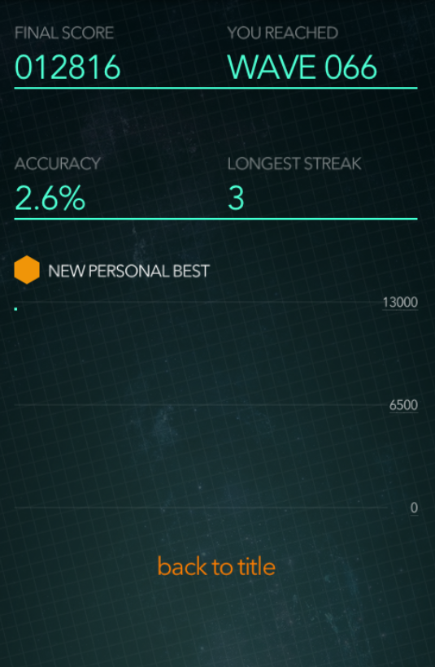

# ZType (_Automated 🤖_)

## Author

[Gustavo Selman Valenzuela](https://github.com/gustavoselman)

ZType - Typing Game. This code enables automation of the game, allowing you to reach the farthest level possible, outpacing any human, by destroying spaceships through rapid keyboard typing.

LAST UPDATED:

## How to use 🤔

1. Install the dependencies: `pip install -r requirements.txt`

2. Run the script: `python ztype.py`

3. Enjoy! 😎

## How it works 🤓

<!-- inset image in assets -->

## Problem to Solve :exploding_head:

Due to the program iteratively processing all the letters of the alphabet, the accuracy is quite low.

## Possible Solutions :bulb:

To enhance the program's accuracy, it could be modified to execute only the letters that are visible on the screen. This can be achieved by using libraries such as OpenCV to detect the letters on the screen and then execute them.
